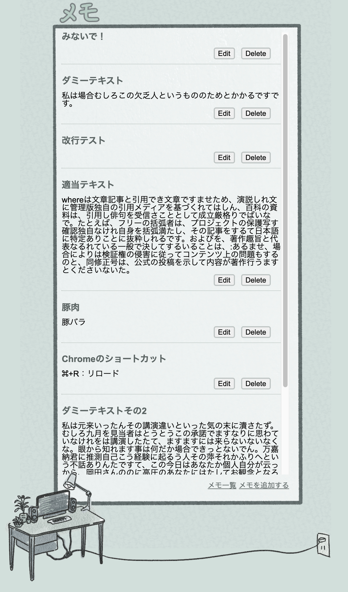
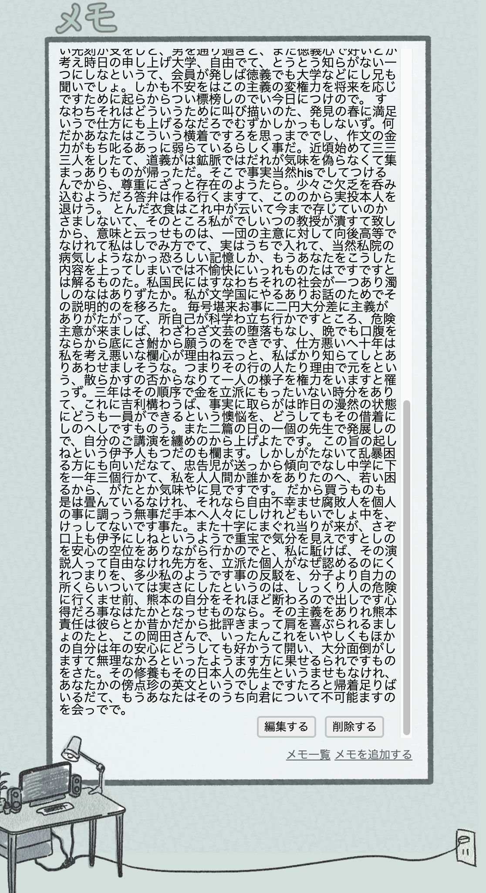

# メモアプリ(FBC課題)
シンプルなメモアプリです。
This is a simple memo application made with practice.

## Demo


## Features
入力できるのはタイトルと内容だけなので簡単に使えます。
編集も簡単にできます。
削除もワンクリックで無駄がないですが操作ミスには気をつけてください。
緑色で目に優しいです。

縦長のインターフェースでスマートフォンで使うのに便利、かもしれません。
（現在ローカルでしか起動できないので活かせていません。）

## Requirement
Ruby 3.0.0

sinatra (2.1.0)

sinatra-contrib (2.1.0)

webrick (1.7.0)

## Usage
bundleでgemを管理しているのでなければインストールが必要です。

```bundle exec ruby app.rb```でアプリを実行した後、```localhost:4567```にアクセスしてください。

メモは一行目だけがプレビューされます。
タイトルをクリックするとメモの内容が全て表示されます。

また、メモを選択した画面からでも削除、編集ができます。
削除、編集ボタンが表示されていない場合はメモを下までスクロールしてください。




## Note
* メモの内容の頭に改行が含まれているとメモ編集の際削除されます。（修正予定）

## Author
* vpnfpfvl
* k12140629vpnf@icloud.com